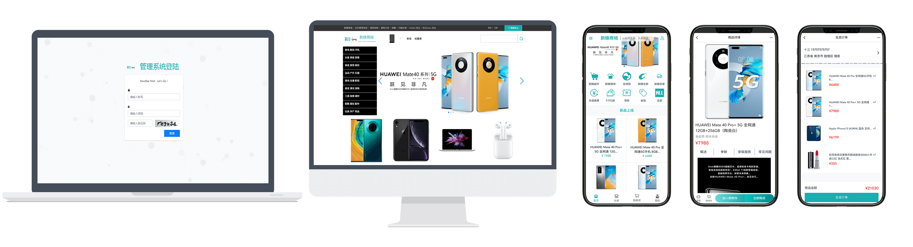

newbee-mall 项目是一套电商系统，包括 newbee-mall 商城系统及 newbee-mall-admin 商城后台管理系统，基于 Spring Boot 2.X 和 Vue 以及相关技术栈开发。 前台商城系统包含首页门户、商品分类、新品上线、首页轮播、商品推荐、商品搜索、商品展示、购物车、订单结算、订单流程、个人订单管理、会员中心、帮助中心等模块。 后台管理系统包含数据面板、轮播图管理、商品管理、订单管理、会员管理、分类管理、设置等模块。

本仓库中的源码为新蜂商城前后端分离版本的 Vue 项目（Vue 版本为 3.x），主要面向前端开发人员，后端 API 源码在另外一个仓库 [newbee-mall-api](https://github.com/newbee-ltd/newbee-mall-api)。

新蜂商城 Vue3 版本线上预览地址：[http://vue3-app.newbee.ltd](http://47.99.134.126:5008)，账号可自行注册，建议使用手机模式打开。

前后端分离版本包括四个仓库：

- [新蜂商城后端接口 newbee-mall-api](https://github.com/newbee-ltd/newbee-mall-api)
- [新蜂商城 Vue2 版本 newbee-mall-vue-app](https://github.com/newbee-ltd/newbee-mall-vue-app)
- [新蜂商城 Vue3 版本 newbee-mall-vue3-app](https://github.com/newbee-ltd/newbee-mall-vue3-app)
- [新蜂商城后台管理系统 Vue3 版本 vue3-admin](https://github.com/newbee-ltd/vue3-admin)

> Vue2 版本与 Vue3 版本分成两个仓库，大家需要哪个版本就去对应的仓库即可。

## 开发及部署文档

- [向“全栈”进发！大型线上商城实战项目，Spring Boot + Vue 前后端分离版本的商城来了！](https://juejin.im/book/6844733826191589390)

## 软件著作权

> 本系统已申请软件著作权，受国家版权局知识产权以及国家计算机软件著作权保护！

